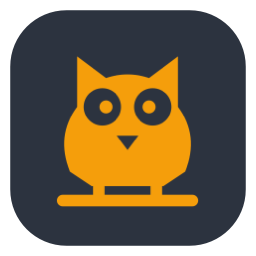

<h1 align="center">Owl</h1>

A tiny macOS menu-bar app: pick 3, 6, or 9 hours to keep your Mac awake, with an optional battery mode.
Unlike `caffeinate` alone, Owl uses a privileged helper to keep working with the lid closed while letting the screen turn off.

  

macOS 13+ · Apple silicon · Administrator password required on first use

